<a id="readme-top"></a>
<br />
<div align="center">

<h3 align="center">Notes Manager</h3>

  <p align="center">
    Una API que proporciona el Backend de un gestor de notas, ofreciendo lo necesario para una cómoda gestión tanto de usuarios como de las notas que estos poseen.
    <br />
    <a href="https://github.com/Alvaro-Rubina/Notes-Manager"><strong>Observa el proyecto! »</strong></a>
    <br />
    <br />
  </p>
</div>
<!-- TABLE OF CONTENTS -->
<details>
  <summary>Índice</summary>
  <ol>
    <li>
      <a href="#acerca-de">Acerca de</a>
      <ul>
        <li><a href="#tecnologías-utilizadas">Tecnologías utilizadas</a></li>
      </ul>
    </li>
    <li>
      <a href="#instalación-y-uso">Instalación y uso</a>
      <ul>
        <li><a href="#requerimientos-previos">Requerimientos previos</a></li>
        <li><a href="#pasos-a-seguir">Pasos a seguir</a></li>
      </ul>
    </li>
    <li>
      <a href="#guía-de-uso">Guía de uso</a>
      <ul>
        <li>
          <a href="#user">User</a>
          <ul>
            <li><a href="#new-user">New User</a></li>
            <li><a href="#find-user">Find User</a></li>
            <li><a href="#find-all">Find all</a></li>
            <li><a href="#edit-user">Edit User</a></li>
            <li><a href="#delete-user">Delete User</a></li>
          </ul>
        </li>
        <li>
          <a href="#note">Note</a>
          <ul>
            <li><a href="#new-note">New Note</a></li>
            <li><a href="#find-note">Find Note</a></li>
            <li><a href="#find-all">Find all</a></li>
            <li><a href="#edit-note">Edit Note</a></li>
            <li><a href="#delete-note">Delete Note</a></li>
          </ul>
        </li>
      </ul>
    </li>
    <li><a href="#contacto">Contacto</a></li>
    <li><a href="#menciones">Menciones</a></li>
  </ol>
</details>


<!-- ABOUT THE PROJECT -->
## Acerca de


Notes Manger es una REST API desarollada con Spring Boot que proporciona las herramientas necesarias para de gestionar usuarios y sus notas de manera eficiente. Para asegurar la persistencia de los datos, se hace uso de una base de datos MySQL, permitiendo realizar operaciones como crear, editar, consultar y eliminar usuarios y notas.
El proyecto emplea una arquitectura multicapas que incluye las capas Controller, Model, Service, DTO y DAO). También se cuenta con herramientas clave como:
- **Swagger**: Para la documentación.
- **MapStruct**: Para el mapeo entre entidades y DTOs.
- **Mockito**: Para la realización de pruebas unitarias.
- **Lombok**: Para reducir el código boilerplate.


*Proximamente se agregará autenticación*

<p align="right">(<a href="#readme-top">Volver al inicio</a>)</p>


### Tecnologías utilizadas

* [](https://spring.io/projects/spring-boot)
* [](https://www.mysql.com/)
* [](https://hibernate.org/)
* [](https://mapstruct.org/)
* [](https://swagger.io/)
* [](https://junit.org/)
* [](https://site.mockito.org/)
* [](https://projectlombok.org/)


<p align="right">(<a href="#readme-top">Volver al inicio</a>)</p>


<!-- GETTING STARTED -->
## Instalación y uso

Para poder probar **Notes Manager** tené en cuenta lo siguiente.

### Requerimientos Previos

Primero que nada, asegurate de tener instalados los siguientes programas en tu máquina:

- **Git**: Para clonar el repositorio.
- **Docker**: Para construir y ejecutar los contenedores de la aplicación. Si no lo tenés instalado, podés descargarlo desde el siguiente enlace:
  - [Docker Desktop](https://www.docker.com/products/docker-desktop)


### Pasos a seguir

1. **Clonar el repositorio**
   
   Abrí una terminal y cloná el repositorio con el siguiente comando:
   ```sh
   git clone https://github.com/Alvaro-Rubina/Notes-Manager.git
   ```
   Después, navegá al directorio raíz del proyecto:
   ```sh
   cd Notes-Manager
   ```
   
   
  * Variables de entorno: Dentro del directorio del proyecto hay un archivo llamado ``.env.example`` que contiene valores de ejemplo para las variables que ocupará Docker Compose para funcionar.
    Renombrá dicho archivo ``.env`` con el siguiente comando:
       ```sh
       mv .env.example .env
       ```


2. **Construir y levantar los contenedores**
   
   **A partir de acá es indispensable que Docker esté en ejecución, así que ejecutá Docker Desktop en tu PC.**

   Una vez en el directorio raíz del proyecto, el siguiente paso es construir la imagen Docker y levantar los contenedores de la base de datos y de la aplicación en sí.
   
   Construí la imagen:
   ```sh
   docker-compose build
   ```
   Levantá los contenedores:
   ```sh
   docker-compose up
   ```
   (*A medida que sigas los pasos vas a poder ver el estado actual en la terminal, pero si querés, tambien podés comprobar que todo vaya bien desde las pestañas **Images** y **Containers** desde Docker Desktop.*)

   Si seguiste todos los pasos anteriores, al final vas a ver los siguiente logs en la terminal:
   ```log
   notes-manager-1  | 20XX-XX-XXT12:00:00.017Z  INFO 1 --- [notes-manager] [           main] o.s.b.w.embedded.tomcat.TomcatWebServer  : Tomcat started on port 8080 (http) with context path ''
   notes-manager-1  | 20XX-XX-XXT00:00:00.050Z  INFO 1 --- [notes-manager] [           main] o.a.n.NotesManagerApplication            : Started NotesManagerApplication in X.XXX seconds (process running 
   for X.XXX)
   ```
   Donde, en resumen, señalan que la aplicación ya está funcionando en el puerto 8080.


3. **Detener la ejecución**

   Para detener la ejecución y eliminar los contenedores, escribí el siguiente comando:
   ```sh
   docker-compose down
   ```
   *Es posible que luego de levantar los contenedores, la terminal no te permita seguir escribiendo, en tal caso simplemente abrís otra terminal en el directorio raíz del proyecto y escribís el comando anterior.*


<p align="right">(<a href="#readme-top">Volver al inicio</a>)</p>


<!-- USAGE EXAMPLES -->
## Guía de uso

En esta sección se demuestra el funcionamiento de cada endpoint mediante ejemplos de solicitudes HTTP, de esta forma vas a comprender cómo realizar un CRUD tanto de Usuarios como Notas.  
Antes de profundizar, dirigite a la siguiente dirección en tu navegador: http://localhost:8080/swagger-ui/index.html. Cuando hayas accedido, te vas a encontrar con una interfaz visual amigable que proporciona Swagger, donde se documentaron los endpoints.

Mas adelante se muestran ejemplos realizados mediante la interfaz que brinda Swagger. Si deseas probar los endpoints mediante Postman, accede a colección con el siguiente botón:

[](https://app.getpostman.com/run-collection/33441736-6b60df2c-fc2f-46c4-97d6-56dadc13a173?action=collection%2Ffork&source=rip_markdown&collection-url=entityId%3D33441736-6b60df2c-fc2f-46c4-97d6-56dadc13a173%26entityType%3Dcollection%26workspaceId%3D86789605-6875-4391-8327-7c3a778f18dd)

### User 
---

Dentro de la sección de User se encuentran los endpoints para las distintas solicitudes y una pequeña descripción de lo que hacen.

#### New User

Para registrar un nuevo usuario: HTTP REQUEST **POST** en `/users/new`.

- En el cuerpo de la request se envía un objeto `NewUserDTO` en formato JSON que luego es mapeado a un objeto `User` para ser agregado a la BBDD.
- Todos los parámetros son obligatorios.
- Cada username es único.

<p align="center">Request</p>
<p align="center">
  
  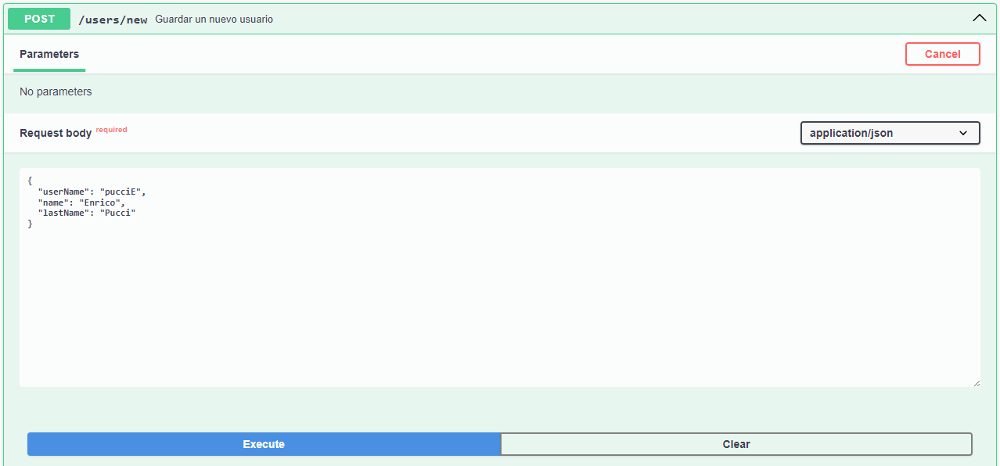
</p>

<p align="center">Response</p>
<p align="center">
  
  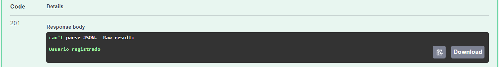
</p>

Responses:
- `201`: Usuario registrado.
- `400`: Parámetros inválidos.


<p align="right">(<a href="#readme-top">Volver al inicio</a>)</p>


#### Find User

Para encontrar un usuario: HTTP REQUEST **GET** en `/users/find/{id}`.

- En el URL se envía el ID del usuario como parámetro.
- Devuelve un objeto `UserDTO`.

<p align="center">Request</p>
<p align="center">
  
  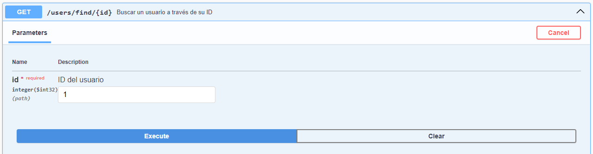
</p>

<p align="center">Response</p>
<p align="center">
  
  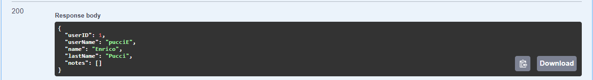
</p>

Responses:
- `200`: Usuario encontrado.
- `404`: Usuario no encontrado.


<p align="right">(<a href="#readme-top">Volver al inicio</a>)</p>


#### Find all

Para encontrar todos los usuarios registrados: HTTP REQUEST **GET** en `/users/find-all`.

- Sin parámetros y sin cuerpo.
- Devuelve una lista de objetos `UserDTO`. Si no hay usuarios, devuelve una lista vacía.

<p align="center">Response</p>
<p align="center">
  
  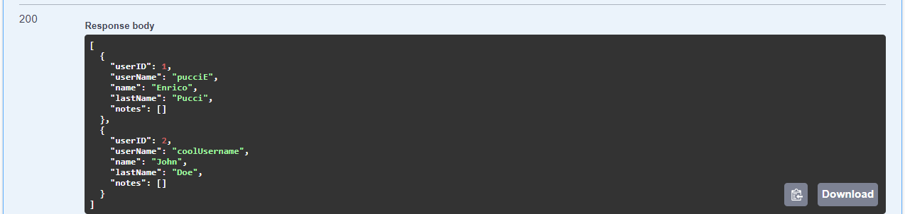
</p>

Responses:
- `200`: OK.


<p align="right">(<a href="#readme-top">Volver al inicio</a>)</p>


#### Edit User

Para editar un usuario: HTTP REQUEST **PUT** en `/users/edit/{id}`.

- En el URL se envía el ID del usuario a editar como parámetro.
- En el cuerpo de la request se envía un objeto `NewUserDTO` en formato JSON con los datos del usuario que van a ser editados. No es obligatorio enviar todos los datos, solo los que van a ser editados.
- El ID en el URL es **OBLIGATORIO**.

<p align="center">Request</p>
<p align="center">
  
  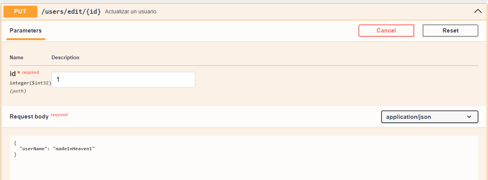
</p>

<p align="center">Response</p>
<p align="center">
  
  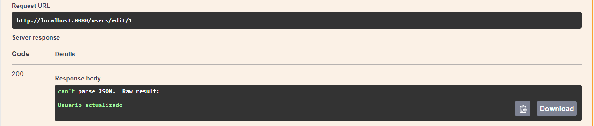
</p>

Si buscamos al usuario con ID = 1 luego de editarlo:

<p align="center">Response</p>
<p align="center">
  
  
</p>

Responses:
- `200`: Usuario actualizado.
- `400`: Parámetros inválidos.
- `404`: Usuario no encontrado.


<p align="right">(<a href="#readme-top">Volver al inicio</a>)</p>


#### Delete User

Para eliminar un usuario: HTTP REQUEST **DELETE** en `/users/delete/{id}`.

- En el URL se envía el ID del usuario a eliminar como parámetro.

<p align="center">Request</p>
<p align="center">
  
  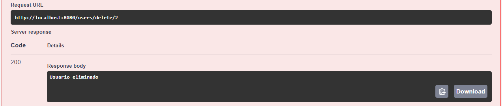
</p>

RESPONSES:
- `200`: Usuario eliminado.
- `404`: Usuario no encontrado.


<p align="right">(<a href="#readme-top">Volver al inicio</a>)</p>


### Note
---

Dentro de la sección de Note se encuentran los endpoints para las distintas solicitudes y una pequeña descripción de lo que hacen.

#### New Note

Para guardar una nueva nota: HTTP REQUEST **POST** en `/notes/new`.

- En el cuerpo de la request se envía un objeto `NewNoteDTO` en formato JSON que luego es mapeado a un objeto `Note` para ser agregado a la BBDD.
- Todos los parámetros son obligatorios.
- creatorID hace referencia al usuario que ha creado la nota.

<p align="center">Request</p>
<p align="center">
  
  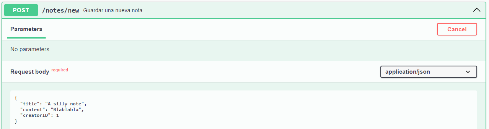
</p>

<p align="center">Response</p>
<p align="center">
  
  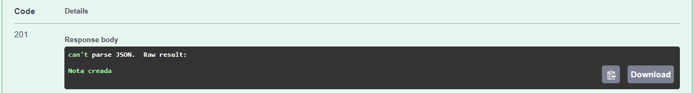
</p>

Responses:
- `201`: Nota creada.
- `400`: Parámetros inválidos.
- `404`: Usuario no encontrado.


<p align="right">(<a href="#readme-top">Volver al inicio</a>)</p>


#### Find Note

Para encontrar una nota: HTTP REQUEST **GET** en `/notes/find/{id}`.

- En el URL se envía el ID de la nota como parámetro.
- Devuelve un objeto `NoteDTO`.

<p align="center">Request</p>
<p align="center">
  
  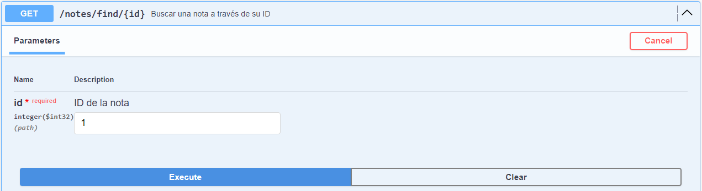
</p>

<p align="center">Response</p>
<p align="center">
  
  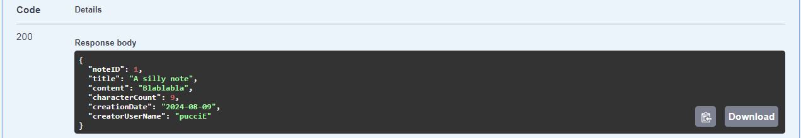
</p>

Responses:
- `200`: Nota encontrada.
- `404`: Nota no encontrada.


<p align="right">(<a href="#readme-top">Volver al inicio</a>)</p>


#### Find all

Para encontrar todas las notas guardadas: HTTP REQUEST **GET** en `/notes/find-all`.

- Sin parámetros y sin cuerpo.
- Devuelve una lista de objetos `NoteDTO`. Si no hay notas, devuelve una lista vacía.

<p align="center">Response</p>
<p align="center">
  
  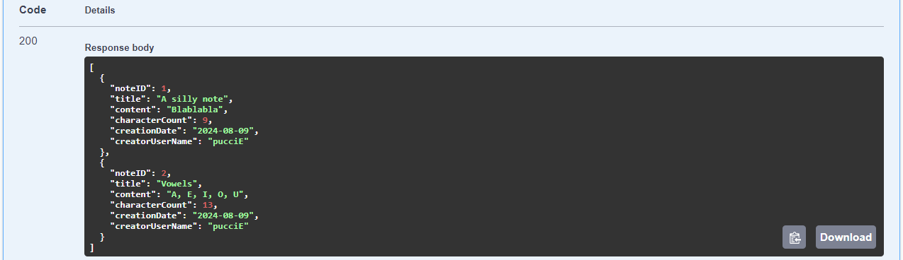
</p>

Responses:
- `200`: OK.


<p align="right">(<a href="#readme-top">Volver al inicio</a>)</p>


#### Edit Note

Para editar una nota: HTTP REQUEST **PUT** en `/notes/edit/{id}`.

- En el URL se envía el ID de la nota a editar como parámetro.
- En el cuerpo de la request se envía un objeto `NewNoteDTO` en formato JSON con los datos de la nota que van a ser editados. No es obligatorio enviar todos los datos, solo los que van a ser editados.
- El ID en el URL es **OBLIGATORIO**.

<p align="center">Request</p>
<p align="center">
  
  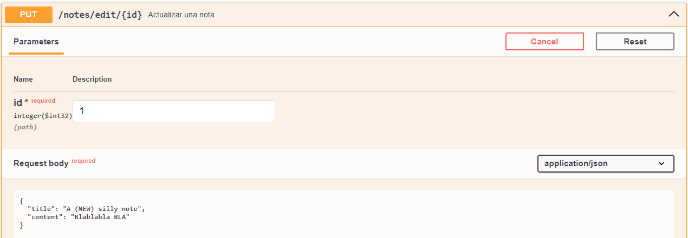
</p>

<p align="center">Response</p>
<p align="center">
  
  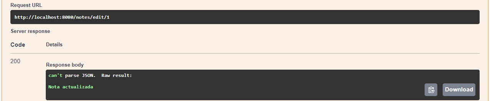
</p>

Si buscamos a la nota con ID = 1 luego de editarla:

<p align="center">Response</p>
<p align="center">
  
  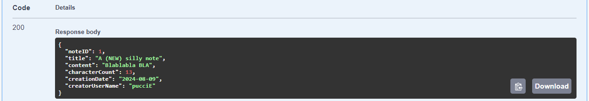
</p>

Responses:
- `200`: Nota actualizada.
- `400`: Parámetros inválidos.
- `404`: Nota o usuario no encontrado.


<p align="right">(<a href="#readme-top">Volver al inicio</a>)</p>


#### Delete Note

Para eliminar una nota: HTTP REQUEST **DELETE** en `/notes/delete/{id}`.

- En el URL se envía el ID de la nota a eliminar como parámetro.

<p align="center">Request</p>
<p align="center">
  
  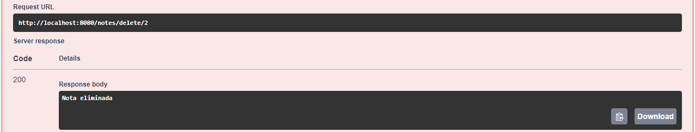
</p>

RESPONSES:
- `200`: Nota eliminada.
- `404`: Nota no encontrada.


<p align="right">(<a href="#readme-top">Volver al inicio</a>)</p>


<!-- CONTACT -->
## Contacto

Alvaro Rubina - [Linkedin](https://www.linkedin.com/in/alvaro-rubina/) - alvarorubina132@gmail.com

Link del proyecto: [https://github.com/Alvaro-Rubina/Notes-Manager](https://github.com/Alvaro-Rubina/Notes-Manager)

<p align="right">(<a href="#readme-top">Volver al inicio</a>)</p>


<!-- ACKNOWLEDGMENTS -->
## Menciones

* [Plantilla utilizada para el README](https://github.com/othneildrew/Best-README-Template)

<p align="right">(<a href="#readme-top">Volver al inicio</a>)</p>
